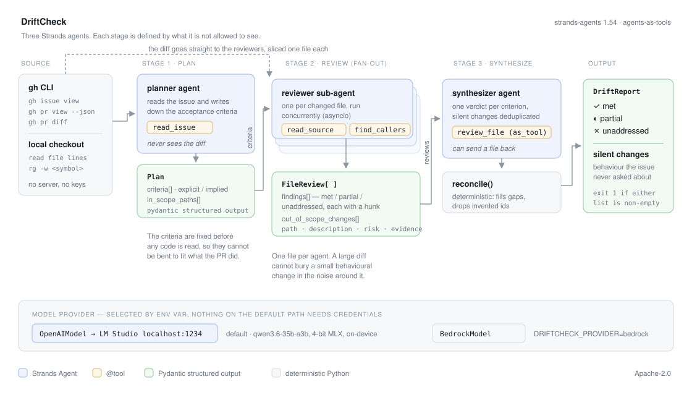

# DriftCheck

A merged pull request says `Closes #1321`. The tests were green, the reviewer approved it,
and it shipped. Six months later something in a neighbouring tool behaves differently and
nobody can say when that happened.

DriftCheck reads a merged PR together with the issue it claims to close and answers the one
question a linter cannot:

- **Did the diff do what the issue asked?** Each acceptance criterion the issue implies,
  marked met / partial / unaddressed, with the hunk that satisfies it or the absence that
  does not.
- **What did it change on the way past?** Behaviour modified outside the scope the issue
  described — the part that bites a reviewer months later.

It runs on a laptop against a local model. No cloud account, no API key, no hosting.



## What it found on a real repository

`ScrollPrize/villa` is a 342-star research monorepo. Issue
[#1321](https://github.com/ScrollPrize/villa/issues/1321) reports that two tools drop
metadata, names the two tools, and asks for them to be fixed the way a third tool already
does it. PR [#1387](https://github.com/ScrollPrize/villa/pull/1387) closed it and was merged.

DriftCheck confirms all four criteria are met, each with the hunk that satisfies it, and
then reports this:

```
── silent changes ─────────────────────────────────────────────────────────────
  ● MEDIUM  volume-cartographer/apps/src/vc_straighten.cpp
      saveGrid no longer unconditionally erases 'bbox' from meta.json; instead it
      recomputes the bounding box via bbox_of_valid_points and preserves it when valid
      points exist, only erasing if there are genuinely no valid points.
      → saveGrid lines 131-140: replaced `meta.erase("bbox")` with a recomputation block

  ● MEDIUM  volume-cartographer/apps/src/vc_project_tifxyz.cpp
      Changes metadata initialization from empty to `src->meta`, preserving source
      provenance keys (scroll_source, target_volume, seed) in the output.
      → `Json meta = src->meta;` replacing `Json meta;` in main()
```

Neither file appears anywhere in issue #1321, which names four tools and asks for two of
them to be fixed. Both had their metadata output behaviour changed anyway. Neither is a bug
— both are arguably improvements — and that is the point: they are real behaviour changes
no criterion asked for, in files the issue never mentioned, and nothing in the PR title, the
issue, or CI says so.

The full run is in [`examples/villa-pr-1387.txt`](examples/villa-pr-1387.txt), with the raw
per-agent output in [`examples/villa-pr-1387.json`](examples/villa-pr-1387.json).

For contrast, [`examples/villa-pr-1440.txt`](examples/villa-pr-1440.txt) is a PR from the
same repo that stayed inside its brief: **no silent changes at all**. A tool that flags
everything is worth nothing.

Runs are not deterministic. A 4-bit local model will phrase a finding differently between
runs and sometimes splits or merges a criterion. Across repeated runs of #1387 the
`vc_straighten` finding was present every time; the wording of the criteria varied. Low-risk
entries are hidden by default because in practice they collect "a helper was added" noise —
`--all` shows them.

## How it works

Three Strands agents, and the design is in what each one is denied.

**Planner.** Reads the issue through a `read_issue` tool and writes down the acceptance
criteria. It never sees the diff. Criteria extracted after reading a diff drift toward
whatever the diff happened to do; extracted first, they are a fixed target the PR is
measured against. Each is tagged `explicit` (the issue says it) or `implied` (it follows
from the report — a bug report rarely states "the bug no longer reproduces" as a
requirement, but that is the requirement).

**Reviewers.** One sub-agent per changed file, run concurrently, each holding the criteria
and exactly one file's diff. A reviewer that can see the whole PR reads a 400-line
refactor and stops noticing the four-line default change inside it. It has `read_source`
to see code the diff did not include, and `find_callers` (ripgrep) to check who a changed
symbol affects before calling the change harmless.

**Synthesizer.** Holds the criteria and every file review, and is the only stage allowed
to call a verdict. It has the reviewer wrapped as a tool (`Agent.as_tool()`), so it can
send a file back for a second look when two reviews conflict in a way that changes an
outcome.

A deterministic `reconcile()` pass then forces one verdict per criterion — filling any the
model dropped as `unaddressed` and discarding ids it invented. A report whose whole claim
is per-criterion coverage cannot be allowed to quietly cover fewer criteria than it was
given.

Exit code is 1 when anything is unmet or any silent change is found, so it drops into CI as
a post-merge check.

## Quickstart

```bash
git clone https://github.com/dud8/driftcheck && cd driftcheck
python3 -m venv .venv && .venv/bin/pip install -e '.[dev]'
gh auth login                    # DriftCheck reads GitHub through your gh CLI
```

Serve a model (see below), then:

```bash
.venv/bin/driftcheck 1387 \
  --repo ScrollPrize/villa \
  --worktree /path/to/villa      # optional; enables read_source and find_callers
```

```
--issue N        analyse against a different issue than the PR body claims
--max-files N    cap the reviewer fan-out (default 10, largest diffs win)
--concurrency N  reviewers in flight (default 3)
--all            include low-risk silent changes (hidden by default)
--json           raw plan, per-file reviews and report
```

## Model setup

The demo above ran entirely on a MacBook Pro (M4 Max, 48 GB) against
**Qwen3.6-35B-A3B, 4-bit MLX**, served by [LM Studio](https://lmstudio.ai) on
`localhost:1234`. Nothing left the machine. A PR of 4–7 files takes 2–3 minutes.

```bash
lms get qwen/qwen3.6-35b-a3b
lms server start
lms load qwen/qwen3.6-35b-a3b --context-length 32768
```

Any OpenAI-compatible endpoint works — vLLM, Ollama, llama.cpp, or the real OpenAI API:

```bash
export DRIFTCHECK_BASE_URL=http://localhost:1234/v1
export DRIFTCHECK_MODEL_ID=qwen/qwen3.6-35b-a3b
export DRIFTCHECK_API_KEY=...          # ignored by most local servers
```

Amazon Bedrock is implemented and selectable, and nothing on the default path touches it:

```bash
export DRIFTCHECK_PROVIDER=bedrock
export DRIFTCHECK_MODEL_ID=us.anthropic.claude-sonnet-4-20250514-v1:0
```

The model must support tool calling and JSON-schema structured output. Both were verified
against Qwen3.6-35B-A3B before any of this was built; a model that fakes tool calls in
prose will fail loudly at the planner rather than produce a plausible wrong report.

## Tests

```bash
.venv/bin/pytest
```

41 tests, no network and no model. The adversarial cases are the ones worth reading:

| case | file |
|---|---|
| PR closes an issue its diff does not address | `test_a_pr_that_addresses_nothing_reports_every_criterion_unaddressed` |
| issue with no extractable criteria | `test_an_issue_with_no_extractable_criteria_yields_an_empty_but_valid_report` |
| model drops criteria from the report | `test_missing_criteria_become_unaddressed_not_silently_dropped` |
| model invents criterion ids | `test_hallucinated_criterion_ids_are_dropped` |
| a reviewer returns nothing | `test_a_reviewer_that_returns_nothing_does_not_sink_the_run` |
| a diff must not leak between reviewers | `test_one_reviewer_per_changed_file_each_seeing_only_its_own_diff` |
| `#12` mentioned is not `#12` closed | `test_issue_refs_only_counts_closing_keywords` |
| a path that escapes the checkout | `test_read_source_refuses_to_escape_the_checkout` |
| a reviewer that raises mid-run | `test_a_reviewer_that_raises_is_reported_not_fatal` |
| a file the issue never named | `test_a_file_the_issue_never_named_is_flagged_as_out_of_scope` |

## Limitations

Stated plainly, because a review tool that oversells itself costs more than it saves.

- **It reads diffs, it does not run code.** A criterion marked `met` means the diff contains
  code that does the thing, not that the thing works. DriftCheck complements tests; it does
  not replace them.
- **`unaddressed` is sometimes pedantically correct and practically wrong.** In the villa
  run, "must not regress `vc_transform_geom`" is marked unaddressed because no hunk touches
  it — which is exactly why it did not regress. The evidence line says so, but the glyph
  still reads red.
- **Criterion extraction is a judgement call.** An issue that buries a request under
  "Minor, related" may or may not deserve a criterion. DriftCheck errs toward extracting it.
- **Silent changes are ranked by a model, not measured.** `find_callers` grounds the risk
  rating in real usage, but `high` is an opinion.
- **A reviewer can still fail.** A local model sometimes will not emit the structured-output
  call. That file is retried once without tools, and if it fails again the run continues and
  names the file in the footer rather than pretending it was reviewed.
- **The file cap is a real cap.** Above `--max-files`, the smallest diffs go unreviewed and
  are listed by name in the footer rather than silently dropped. A 60-file PR is not this
  tool's ground.
- **One issue per PR.** A PR closing three issues is analysed against the first.
- **Local models drift on long diffs.** Per-file diffs are clipped at 18 000 characters.
  Quality on a 2 000-line single-file diff is worse than on ten small ones.

## Prior code

Written for this hackathon. The only pre-existing components are the dependencies:
`strands-agents`, `pydantic`, and the `gh` and `ripgrep` binaries.

Apache-2.0.
